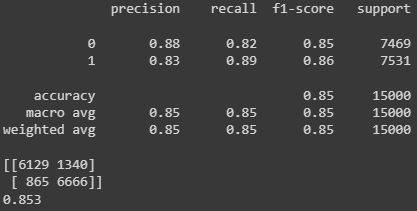

# Movie Review Segmentation
 Categorize movie reviews into 2 two segments: Positive or Negative

## Content
This repository contains 3 python files (train.py, modules.py, deploy.py).

train.py contains the codes to build a deep learning model and train on the dataset.

module.py contains the codes where there are class and functions to be used in train.py and deploy.py.

deploy.py contains the codes to deploy the saved model into new input.

#How run Tensorboard

1. Clone this repository and use the model.h5, ohe.pkl and tokenizer_data.json(inside saved_model folder) to deploy on your dataset.
2. Run tensorboard at the end of training to see how well the model perform via Anaconda prompt. Activate the correct environment.
3. Type "tensorboard --logdir "the log path"
4. Paste the local network link into your browser and it will automatically redirected to tensorboard local host and done! Tensorboard is now can be analyzed.

# The Performance of model

